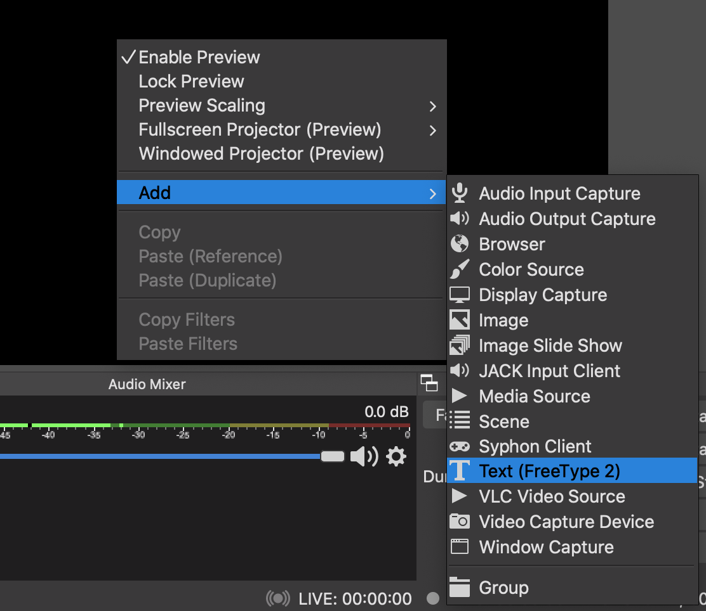
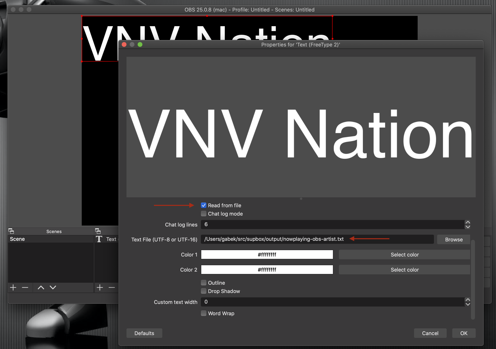
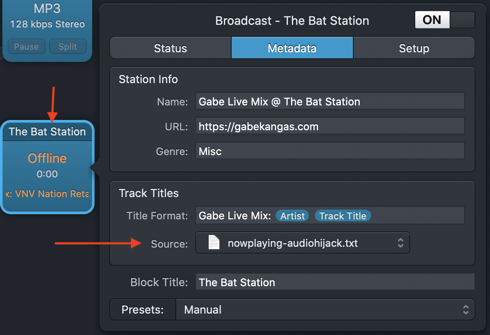
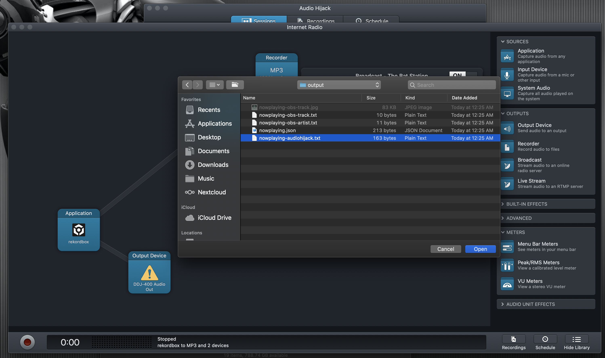

This tool is for users of Pioneer's [Rekordbox v6](https://rekordbox.com/en/) to gain access to their currently playing track.  This data can be used for any number of purposes, but a large one is online streaming of audio and video.  Built-in support for OBS and Audio Hijack are included.

# Currently only supported on macOS

Since I use macOS, and I have an install of Rekordbox on macOS that's what I have it working with.  **However**, there's no reason that somebody who's using Rekordbox on Windows can't help out and make the tweaks needed to point to the file locations on a Windows install.  If there's any demand maybe I'll install a VM and install Rekordbox and I'll do it myself.

# Overview

1. Open the _config/config.yaml_ file.
2. Make sure the _application_ path points to your copy of Rekordbox.app (version 6) on your computer.
3. Decide where you want the output files to go such as an "output" directory.  Create this directory if needed.
4. Decide if you are using [OBS](https://obsproject.com/), [Audio Hijack](https://rogueamoeba.com/audiohijack/), or JSON output.
5. You can remove any of the config file output destinations you're not using.


# Using with [OBS](https://obsproject.com/)

If you're using OBS the file path of _nowplaying-obs-*_ would generate three files: 
* nowplaying-obs-artist.txt (just the artist name)
* nowplaying-obs-track.txt (just the track name)
* nowplaying-obs-track.jpg (just the track image)

[Within OBS you can then point to these files](https://www.reddit.com/r/Twitch/comments/4k6jpv/obs_studio_text_source_from_file/) and add the Metadata to your broadcast.

Here's an example setup:

<center>
  <a href="doc/obs1.png">
    
  </a>
  <a href="doc/obs2.png">
    
  </a>
</center>

# Using with [Rogue Ameba Audio Hijack](https://rogueamoeba.com/audiohijack/)

You can point Audio Hijack at a specially formatted text file and the software will read it and treat it as the current Metadata.  This file location is configured in the config file as _audioHijack_ under _output_.

For example you can set it to _output/nowplaying-audiohijack.txt_ and the contents of the file would look something like

```
Title: Retaliate
Artist: VNV Nation
Artwork: /Users/me/Library/Pioneer/rekordbox/share/PIONEER/Artwork/bd3/82718-334f-482d-ad0a-82a1f8ba2507/artwork.jpg
```

Here's an example setup:

<center>
  <a href="doc/audioHijack1.png">
    
  </a>
  <a href="doc/audioHijack2.png">
    
  </a>
</center>

[Please read the details that Rogue Ameba has provided](https://rogueamoeba.com/support/knowledgebase/?showArticle=AudioHijack-Metadata) under the __Metadata from a “Now Playing.txt” file__ section if you have questions.

# JSON Output

An option to generate a JSON file with the Metadata is available for other uses.  Upload it to a web server, have your text to speech engine read the current track, whatever ideas you can come up with.

```
{"ID":"6d655f64-f2e5-4ec9-bd51-3a2c86984c8e","artist":"VNV Nation","track":"Retaliate","imagePath":"/Users/gabek/Library/Pioneer/rekordbox/share/PIONEER/Artwork/bd3/82718-334f-482d-ad0a-82a1f8ba2507/artwork.jpg"}
```

# Disclaimers

* This tool relies on Rekordbox marking a track as **"played"** before we know it's the most recently played track.  I've found this currently happens one minute into playback.  **This is not optimal**, as I'd really love to know this immediately.  However, this is what Rekordbox is doing and I'll keep looking to see if there's any other way to work with this.

* We're doing things with Recordbox that are unsupported and even likely completely unwanted by Pioneer.  Things could change by them at any moment and even shut this down completely.

# Thank yous

* rekordcloud went into detail about the internals of Rekordbox v6 https://rekord.cloud/blog/technical-inspection-of-rekordbox-6-and-its-new-internals.
* LePopal's PRACT-OBS had some code that pointed me in the right direction with getting the database decryption to work and gave me the idea to add OBS support.  https://github.com/LePopal/PRACT-OBS/ 